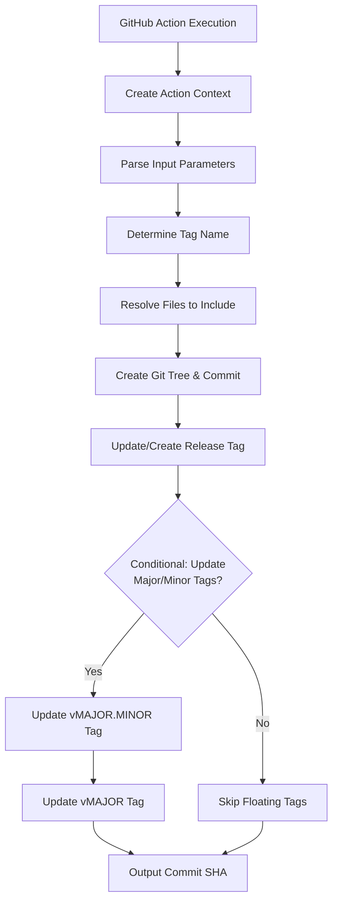

# Core Workflow and Data Flow

## Overview

The build-and-tag-action follows a clear orchestration pattern that transforms GitHub Action source code into properly tagged releases. This document describes the main data flow and decision points.

## High-Level Workflow



## Step-by-Step Flow

### 1. Context Creation (`/src/context.ts`)

**Purpose**: Establish execution environment and dependencies

**Key Operations**:

- Validate `GITHUB_TOKEN` environment variable
- Parse GitHub environment variables (`GITHUB_REPOSITORY`, `GITHUB_WORKSPACE`, etc.)
- Read event payload from `GITHUB_EVENT_PATH`
- Initialize GitHub API client
- Read and parse `package.json`

**Source**: `createContext()` function returns `ActionContext` interface

### 2. Input Processing (`/src/inputs.ts`)

**Purpose**: Read and validate action inputs

**Key Inputs**:

- `tag_name`: Optional, falls back to release event tag
- `commit_message`: Optional, defaults to "Automatic compilation"
- `additional_files`: Optional comma-separated list
- `update_major_minor_tags`: Optional boolean, defaults to `true`

**Source**: `getCommitMessage()`, `getAdditionalFilesFromInput()`, `shouldUpdateMajorMinorTags()`

### 3. Tag Name Resolution (`/src/lib/get-tag-name.ts`)

**Priority Order**:

1. **Explicit Input**: `tag_name` parameter (highest priority)
2. **Release Event**: `release.tag_name` from payload
3. **Error**: Throws `No tag name provided` if neither available

**Business Rule**: On release events, uses the tag being released unless overridden

### 4. File Discovery Pipeline (`/src/lib/resolve-publishable-files.ts`)

#### Phase 1: Source Identification

```typescript
// Order of discovery:
1. findActionFileName()        // Locates action.yml or action.yaml
2. getActionEntrypoints()      // Extracts runs.main, runs.pre, runs.post
3. package.json.main           // Primary compiled entrypoint
4. additional_files input      // User-specified extra files
5. package.json.files array    // Package file patterns
```

#### Phase 2: Processing & Validation

- Remove duplicate file paths
- Validate file existence (warns on missing files)
- Recursively expand directories
- Convert Windows paths to forward slashes
- Ensure minimum requirements met (main or multiple entrypoints)

#### Phase 3: Tree Preparation

- Read each file as base64 (binary-safe)
- Create GitHub API blob for each file
- Build Git tree structure

### 5. Commit Creation (`/src/lib/create-commit.ts`)

**Process**:

1. Create blobs for all resolved files via GitHub API
2. Build Git tree with file structure
3. Create commit with:
   - Tree SHA
   - Parent commit (current tag reference)
   - Commit message
4. Return commit SHA

**Validation**: Ensures either `package.json.main` exists or multiple entrypoints are present

### 6. Tag Reference Management (`/src/lib/create-or-update-ref.ts`)

**Logic**:

```typescript
try {
  // Check if tag exists
  await git.getRef({ ref: `refs/tags/${tagName}` });
  // Update existing tag
  await git.updateRef({ ref: `refs/tags/${tagName}`, sha: commitSha, force: true });
} catch (error) {
  if (error.status === 404) {
    // Create new tag
    await git.createRef({ ref: `refs/tags/${tagName}`, sha: commitSha });
  } else {
    throw error;
  }
}
```

### 7. Floating Tag Updates (`/src/lib/index.ts`)

**Conditional Logic**:

```typescript
let rewriteMajorAndMinorRef = shouldUpdateMajorMinorTags();

// Skip for draft/pre-release releases
if (ctx.eventName === 'release') {
  const release = ctx.payload.release as { draft?: boolean; prerelease?: boolean };
  if (release?.draft || release?.prerelease) {
    rewriteMajorAndMinorRef = false;
  }
}

// Skip for pre-release versions (e.g., v1.0.0-alpha.1)
if (semver.prerelease(tagName)) {
  rewriteMajorAndMinorRef = false;
}

// Update if allowed and valid semver
if (rewriteMajorAndMinorRef) {
  const cleanTag = semver.clean(tagName);
  if (cleanTag) {
    const majorStr = semver.major(cleanTag).toString();
    const minorStr = semver.minor(cleanTag).toString();
    await createOrUpdateRef(ctx, commitSha, `v${majorStr}.${minorStr}`);
    await createOrUpdateRef(ctx, commitSha, `v${majorStr}`);
  }
}
```

## Data Flow Details

### Context Data Structure

```typescript
interface ActionContext {
  github: ReturnType<typeof github.getOctokit>;
  repo: { owner: string; repo: string };
  workspace: string;
  sha: string;
  eventName: string;
  payload: any;
  getPackageJSON: <T = unknown>() => Promise<T>;
}
```

### File Resolution Data Flow

```
Raw Inputs → Normalized Paths → File Existence Check → Blob Creation → Tree Building
    ↓            ↓                  ↓                     ↓              ↓
additional_files  path.normalize()  fs.existsSync()  createBlob()  createTree()
package.json.files  .replace(/\\/g, '/')  core.warning()  base64 encoding  tree structure
```

### API Interaction Pattern

All GitHub API calls follow this pattern:

1. Use authenticated Octokit client from context
2. Handle 404 errors gracefully (for missing refs)
3. Convert errors to action failures with descriptive messages
4. Use appropriate API endpoints:
   - `git.createBlob()` for file content
   - `git.createTree()` for directory structure
   - `git.createCommit()` for commits
   - `git.getRef()` / `git.updateRef()` / `git.createRef()` for tags

## Error Handling Strategy

### Validation Errors (Pre-execution)

- Missing `GITHUB_TOKEN`
- No `action.yml` or `action.yaml` found
- No tag name provided
- Missing `package.json.main` with single entrypoint

### Runtime Errors (Execution failures)

- GitHub API errors (network, permissions, rate limits)
- File system errors (missing files, permission denied)
- Invalid YAML/JSON parsing

### Business Logic Errors

- Invalid semver tag format
- Invalid boolean input values
- Malformed file paths

## Performance Considerations

### File Processing

- **Binary Safety**: Base64 encoding ensures no corruption but adds ~33% size overhead
- **Directory Expansion**: Recursive directory traversal for `package.json.files` patterns
- **Duplicate Elimination**: Set-based deduplication prevents redundant blob creation

### API Efficiency

- **Batch Operations**: Files processed sequentially (could be optimized)
- **Error Recovery**: 404 errors handled gracefully for missing refs
- **Rate Limiting**: Relies on GitHub's built-in rate limiting for Octokit

## Source References

- `/src/lib/index.ts` - Main orchestration (lines 9-43)
- `/src/lib/resolve-publishable-files.ts` - File resolution (lines 1-47)
- `/src/lib/create-commit.ts` - Commit creation (lines 1-71)
- `/src/lib/create-or-update-ref.ts` - Tag management (lines 1-38)

---

**Next**: [Module Responsibilities](modules.md) for detailed component documentation.
